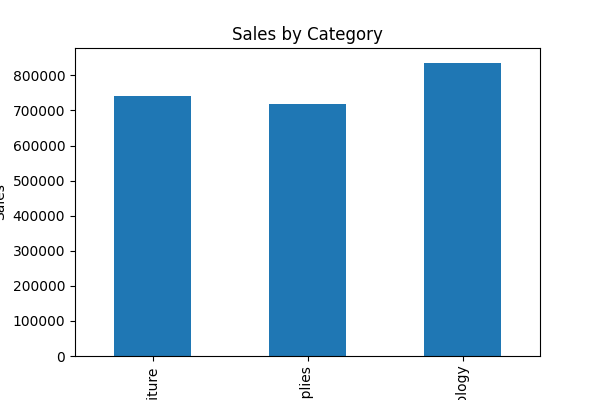

# 📊 Sales Data Analysis Dashboard

## 🚀 Project Overview
This project is an interactive Sales Data Analysis Dashboard built using Python and Streamlit. It helps analyze retail sales performance across regions, categories, and sub-categories.

---

## 🛠️ Tools Used
- Python
- Pandas
- Matplotlib
- Streamlit
- Jupyter Notebook

---

## 📊 Features
- KPI Metrics (Total Sales, Profit, Orders)
- Sales by Category
- Sales by Region
- Top Sub-Categories Analysis
- Interactive Filters (Region, Category)
- Data Visualization Dashboard

---

## 📸 Dashboard Preview


---

## 📌 How to Run Locally
```bash
pip install streamlit pandas matplotlib
streamlit run app.py
## 🌐 Live Demo
👉 https://sales-data-analysis-dashboard-k6ds4qmrhy6wfg6pkjd8t5.streamlit.app/
